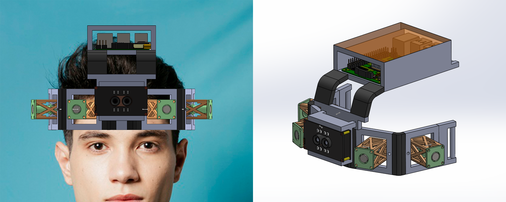
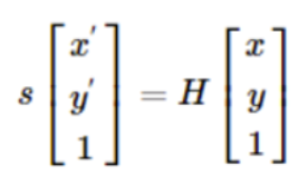

# NavGuide

## About

NavGuide is a device that primarily aims to assist visually challenged people while navigating through new and dynamic environments. Our project focuses on road-crossing scenarios since visually challenged individuals find it the most difficult to cope with. Unlike existing solutions in the literature which use resource-demanding SLAM-based techniques, our algorithm is computationally efficient and fast. NavGuide works based on a framework which depends on a stereo camera for perception of the surroundings. The device contains haptic actuators to give the required feedback to the user. 

## Framework
### Methodology

#### Step 1
First step is to detect the crosswalk. We do it by training a Haar Cascade classifier. The crosswalk is detected in the image frame along with its four corner points. 

#### Step 2
The second step is to orthorectify the image in which the crosswalk was detected. It can be done by applying a homography transformation. The homography transformation matrix is automatically computed by OpenCV given the points (and the location to which the points must be transformed) which need to be transformed from the perspective image plane to orthogonal world plane. Generally, a homography transformation matrix is the product of camera intrinsic and extrinsic matrices. The equation below shows the equation of transformation. 

Here s is the scaling, H is the homography matrix, x' and y' are transformed points, x and y are points that need to be transformed. Once H has been computed, it can be appled to the entire image frame to produce a new orthorectified image plane. The image below illustrates the same. 
&nbsp;

#### Step 3
Next we need to segment the image to correctly identify which part is the sidewalk and which parts are the stripes of the crosswalk. We do this in order to plan a suitable path from the user's location to the start of the zebra crossing. We have used UNET and PyTorch to accomplish this task. The color red represents the stripes while the color blue represents the crosswalk. 

#### Step 4
Haptic feedback is given to the user in order to guide him/her towards the starting edge of the crosswalk. Force and frequency of the tapping is controlled to give a wide range of feedback. Once the user has arrived at the edge of the zebra crossing, the user is made to align with the zebra crossing. 

#### Step 5
The last step is to detect whether there is a traffic signal (which is also done using Cascade Classifiers) and if there is, to check whether the signal is STOP or GO based on which, the user will be directed whether to proceed or not.  

## References
1. 
Olaf Ronneberger, Philipp Fischer, Thomas Brox, "<b>U-Net: Convolutional Networks for Biomedical Image Segmentation</b>"In "<i>Computer Vision and Pattern Recognition, arXiv Labs</i>" 2015. [Link](https://arxiv.org/abs/1505.04597).

2. 
Daryl Tan "<b>A Hands-On Application of Homography: IPM</b>" In "<i>Towards Data Science</i>" 2020.
 [Link](https://towardsdatascience.com/a-hands-on-application-of-homography-ipm-18d9e47c152f).

